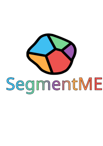

<h1 align="center">
  
</h1>

<p align="center">
  <b>AI-assisted image segmentation and annotation, built for high-throughput phenotyping.</b>
</p>

<p align="center">
  <a href="https://github.com/StevetheGreek97/SegmentME/actions/workflows/build.yml">
    
  </a>
  <a href="LICENSE">
    
  </a>
  
  <a href="https://segmentme.streamlit.app">
    
  </a>
</p>

<p align="center">
  <a href="https://github.com/StevetheGreek97/SegmentME/releases/latest">Download</a> ·
  <a href="https://segmentme.streamlit.app">Full Documentation</a> ·
  <a href="BUILDING.md">Build from Source</a>
</p>

---

SegmentME is a desktop annotation tool for producing pixel-accurate segmentation masks quickly. Point-and-click
with **SAM2 / SAM2.1 / SAM3** or **DEXTR** to get a mask in one or two clicks, fall back to a manual polygon or
intelligent scissors tool when a model gets it wrong, then fine-tune any mask with a freehand brush or a single
cutting stroke — all without leaving the keyboard. When you have enough annotations, export straight to YOLO or
COCO, or train a custom Ultralytics segmentation model on your own data from inside the app.

It runs as a native desktop app on Windows, macOS (Apple Silicon), and Linux — CPU-only or with CUDA acceleration
on Windows/Linux — and needs no cloud service or account to use.

## Features

**Annotation tools**
- **SAM2 / SAM2.1 / SAM3** — one unified tool, prompted with foreground/background points or a bounding box
  (Ctrl + drag), with a model picker in Settings to trade off speed against accuracy
- **DEXTR** — a mask from exactly 4 extreme points, no drawing required
- **Manual** — polygon annotation, point by point
- **Intelligent Scissors** — seed points with the path snapping to edges automatically between them
- **Split Mask** — cut one mask into two with a single freehand stroke
- **Brush Edit** — paint or erase directly on an existing mask

**Workflow**
- Right-click any mask (in the image or the annotations table) for a full actions menu: set class, split, brush
  edit, delete, select all, clear selection
- A searchable, filterable annotations table with per-image and per-project statistics
- Project files (`.SEproj`) with file-type association on every platform — double-click to open
- Batch inference across a whole folder with SAM, YOLO, or Cellpose-SAM
- Train a custom Ultralytics YOLO segmentation model on your own annotated project, from inside the app
- Export to **YOLO** or **COCO**, or dump a flat **CSV** of mask statistics

**Cross-platform packaging**
- Windows installer (CPU or CUDA build)
- Linux `.deb` package or a portable `.tar.gz` for other distributions (CPU or CUDA build), x86_64 and ARM64
- macOS `.dmg` (Apple Silicon)

See the [full keyboard & mouse reference](https://segmentme.streamlit.app) for every shortcut each tool uses.

## Installation

Grab the build for your platform from the [latest release](https://github.com/StevetheGreek97/SegmentME/releases/latest).

| Platform | What you get |
|---|---|
| **Windows** | `SegmentME-Setup-<version>-windows-<flavor>-x64.exe` — run it, done. |
| **Linux (Debian/Ubuntu/Mint)** | `segmentme_<version>_<arch>.deb` — `sudo apt install ./segmentme_<version>_amd64.deb` |
| **Linux (other distros)** | `SegmentME-<version>-linux-<flavor>-<arch>.tar.gz` — extract, then run `./install-desktop.sh` |
| **macOS (Apple Silicon)** | `SegmentME-<version>-macos-cpu-arm64.dmg` — open it, drag SegmentME into Applications |

`<flavor>` is `cpu` or `cuda` (CUDA needs an NVIDIA GPU; if you're not sure, `cpu` works everywhere). See the
[step-by-step install guide](https://segmentme.streamlit.app) for details, screenshots, and troubleshooting.

**Linux CUDA downloads come in parts.** They're about 3.5 GB per file and GitHub caps each release file at 2 GiB, so
download every `.part-NN` file for your format, then join and verify them before installing:

```bash
cat segmentme-cuda_<version>_amd64.deb.part-* > segmentme-cuda_<version>_amd64.deb
sha256sum --ignore-missing -c SHA256SUMS
sudo apt install ./segmentme-cuda_<version>_amd64.deb
```

### Running from source

```bash
git clone https://github.com/StevetheGreek97/SegmentME.git
cd SegmentME
./install.sh   # Linux/macOS -- install.bat on Windows
./run.sh       # Linux/macOS -- run.bat on Windows
```

`install.sh`/`install.bat` create a virtual environment and install everything SegmentME needs, including SAM2,
SAM3, and DEXTR from their upstream repositories. Python 3.10+ is required. See [BUILDING.md](BUILDING.md) if
you want to package your own installer/`.deb`/`.dmg` instead of just running from source.

## Supported models

SAM2 Tiny ships bundled with every build. Everything else downloads on demand from **Settings → Models**.

| Model | Size | Notes |
|---|---|---|
| SAM2 Tiny | 155.9 MB | Fastest, lowest accuracy. **Included.** |
| SAM2 Small | 184.3 MB | Fast, a bit more accurate than Tiny. |
| SAM2 Base+ | 323.5 MB | Balanced speed/accuracy. |
| SAM2 Large | 898.0 MB | Most accurate SAM2, slower. |
| SAM2.1 Tiny | 156.0 MB | Improved SAM2 release, fastest. |
| SAM2.1 Small | 184.4 MB | Improved SAM2 release, fast. |
| SAM2.1 Base+ | 323.6 MB | Improved SAM2 release, balanced. |
| SAM2.1 Large | 898.1 MB | Improved SAM2 release, most accurate. |
| SAM3 | 3.5 GB | Newest and most accurate; large and slow on CPU. Gated on Hugging Face — request access, download `sam3.pt` yourself, then import it in Settings. |
| DEXTR | 195.7 MB | Segments from 4 extreme points instead of a prompt. |

## Documentation

The full user guide — every menu, dialog, tool, and keyboard shortcut — lives at
**[segmentme.streamlit.app](https://segmentme.streamlit.app)**.

## License

[Apache License 2.0](LICENSE).

## Author

Built by [Stylianos (Steve) Mavrianos](https://github.com/StevetheGreek97) —
[Population Genomics Lab](https://www.biologie.uni-hamburg.de/forschung/populationsgenomik.html), Universität Hamburg.
